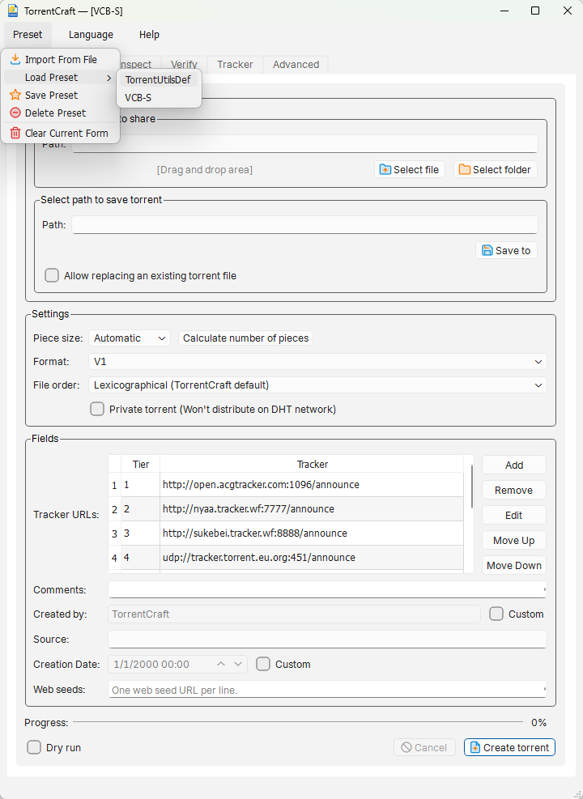

# TorrentCraft

TorrentCraft is a cross-platform BitTorrent tool for creating and managing torrents. It offers a visual desktop app and a command-line interface, sharing the same torrent engine, configuration, presets, and commands.

## Get started

### Command line

Create a torrent from a folder and inspect its metadata:

~~~bash
torrentcraft create ./my-folder -o ./my-folder.torrent
torrentcraft inspect ./my-folder.torrent
~~~

The GUI application can also run every CLI command with the same arguments: pass a command to `torrentcraft-gui` or `torrentcraft-gui.exe` to use CLI functionality without opening the desktop window. The separate CLI binary is smaller and is a good choice for command-line-only systems where disk space matters.

### Desktop app

Use the GUI to create, inspect, verify, and edit torrents; manage trackers; and save reusable presets. The GUI is the easiest option for interactive desktop use.

Read the [CLI getting-started guide](https://amefs.github.io/TorrentCraft/cli/getting-started) or the [GUI guide](https://amefs.github.io/TorrentCraft/cli/gui) for command examples and feature details.

## Which release files should I download?

[Download the standalone binaries from GitHub Releases](https://github.com/amefs/TorrentCraft/releases). Each release has Linux x86_64 and Windows x86_64 builds:

| File name | Includes | Best for |
| --- | --- | --- |
| `TorrentCraft-<version>-linux-musl-x86_64-gui` | Desktop app and all CLI commands | Most Linux desktop users |
| `TorrentCraft-<version>-linux-musl-x86_64-cli` | CLI only | Small installations, scripts, and headless systems |
| `TorrentCraft-<version>-windows-x86_64-gui.exe` | Desktop app and all CLI commands | Most Windows desktop users |
| `TorrentCraft-<version>-windows-x86_64-cli.exe` | CLI only | PowerShell, Command Prompt, scripts, and headless systems |

Choose the **GUI** for interactive use. It can also run any CLI command, so you do not need the separate CLI binary unless you prefer its smaller size. Choose the **CLI** for terminal-only environments or automation. The matching `TorrentCraft-<version>-<platform>-support` archive (`.tar.gz` for Linux, `.zip` for Windows) is optional for running the binaries; download it alongside the binary if you want the release checksums and verification materials.

## Features

- Create V1, V2, and Hybrid torrents.
- Inspect torrent metadata and file trees; verify local files against torrent data.
- Edit torrent metadata and manage tracker lists.
- Use shared configuration and presets from either interface.
- Exclude common system files or define custom Glob filters.
- English and Simplified Chinese interfaces.

## Requirements

- CMake 3.25 or newer
- Ninja
- Clang 16+ or GCC 12+ on Linux
- MSVC 2022 on Windows
- vcpkg at the baseline recorded in `vcpkg.json`

Set `VCPKG_ROOT` to a vcpkg checkout before using the presets:

~~~bash
export VCPKG_ROOT=/path/to/vcpkg
~~~

## Build and test

The normal development build uses the CMake presets:

~~~bash
cmake --preset linux-clang-debug
cmake --build --preset linux-clang-debug
ctest --preset linux-clang-debug
~~~

Other presets cover Clang and GCC release builds, sanitizers, coverage, the Qt GUI,
and MSVC builds on Windows. The presets enable warnings as errors and include the
install-tree consumer test.

To install the SDK:

~~~bash
cmake --preset linux-clang-release
cmake --build --preset linux-clang-release
cmake --install out/build/linux-clang-release \
    --prefix out/install/linux-clang-release
~~~

A downstream CMake project can consume the installed package:

~~~cmake
find_package(TorrentUtilsCore CONFIG REQUIRED)
target_link_libraries(my_target PRIVATE TorrentUtils::Core)
~~~

The public umbrella header is:

~~~cpp
#include <torrentutils/core/core.hpp>
~~~

## Documentation

[Read the online manual](https://amefs.github.io/TorrentCraft/) for CLI commands, GUI workflows, configuration, and presets.

To build the documentation site locally with Node.js:

~~~bash
npm install
npm run docs:build
~~~

## Project vocabulary

Stable API and configuration terminology is documented in [CONTEXT.md](CONTEXT.md).
The implementation deliberately keeps libtorrent, Boost, Qt, JSON, and bencode
implementation types behind the public target boundary.

## Contributing

See [CONTRIBUTING.md](CONTRIBUTING.md) for local checks and contribution guidance.
Pull requests are expected to pass formatting, static analysis, documentation,
build, install-consumer, and functional test checks.

## Acknowledgements

TorrentCraft is inspired by the design and user experience of [qBittorrent](https://github.com/qbittorrent/qBittorrent) and [TorrentUtils](https://github.com/airium/TorrentUtils). It uses [libtorrent](https://github.com/arvidn/libtorrent) as its BitTorrent engine. We thank their authors and contributors for the ideas, code, and open-source libraries that helped make this project possible.

## License

TorrentCraft is licensed under the MIT License. See [LICENSE](LICENSE).
